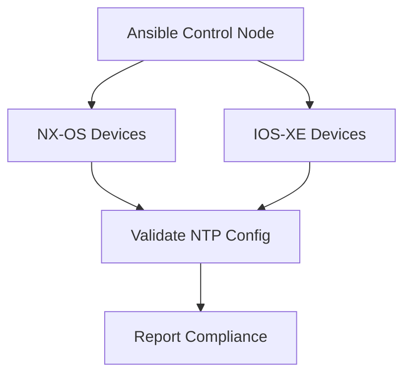

# NTP Configuration Management

This directory contains Ansible playbooks for managing and validating NTP configurations across Cisco network devices (NX-OS and IOS-XE).

---

## 📋 Playbook Descriptions

### ▶️ `Ansible-NTP.yml`
- **Purpose**: Validates NTP server configurations against approved standards
- **Features**:
  - Supports both **NX-OS** and **IOS-XE** devices
  - Compares live device config with expected NTP servers
  - Flags misconfigurations or missing entries
- **Usage**:
  ```bash
  ansible-playbook -i hosts.ini Ansible-NTP.yml
  ```

---

### 🛡 `Ansible-Add-Known-Hosts.yml`
- **Purpose**: Manages SSH known hosts for NTP servers to ensure trusted and secure connections.
- **Security Note**: Ensures secure connections to NTP sources

---

## 🧠 Architecture


> Ansible connects to each target device, verifies the configured NTP servers, and reports compliance status.

---

## ⏱ Expected NTP Servers

| Server | Purpose |
|--------|---------|
| aaa.aaa.aaa.aaa | Primary NTP source |
| bbb.bbb.bbb.bbb | Secondary NTP source |

> ✅ You can customize these in a shared variable file or directly within the playbook vars block.

---

## 🔐 Security Considerations
- Enable **NTP authentication** where supported
- Restrict NTP access using **ACLs** or control-plane policies
- Regularly **audit** NTP sources

---

## 🛠 Troubleshooting

- ✅ Confirm device platform detection using `debug` tasks
- 🧾 Ensure inventory groups (NX-OS, IOS-XE) are correctly defined in `hosts.ini`
- 🔐 Test SSH connectivity to each device before execution

---

## 📁 Files

| File                    | Description                                   |
|-------------------------|-----------------------------------------------|
| `Ansible-NTP.yml`       | Core validation playbook                      |
| `Ansible-Add-Known-Hosts.yml` | SSH fingerprint management for NTP servers |
| `hosts.ini`             | Ansible inventory (grouped by device type)    |
