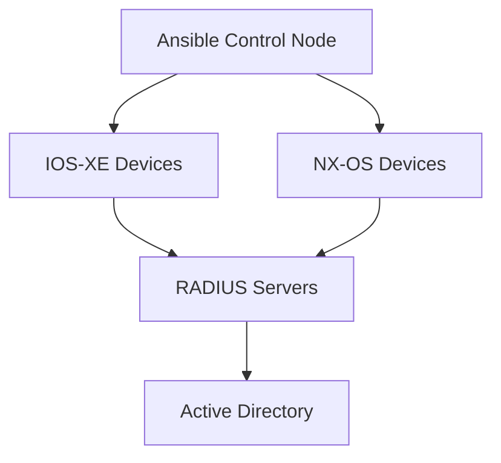

# RADIUS Configuration Management

This directory contains Ansible playbooks for automating the configuration of RADIUS authentication on Cisco network devices, including both **NX-OS** and **IOS-XE** platforms.

---

## 📋 Playbook Descriptions

### ▶️ `IOS_XE_configure_radius.yml`
- **Purpose**: Configures RADIUS authentication on Cisco IOS-XE devices
- **Features**:
  - Adds both **primary** and **secondary** RADIUS servers
  - Creates **server groups** for failover
  - Configures authentication and authorization methods
  - Uses **Ansible Vault** for secure credential storage
- **Usage**:
  ```bash
  ansible-playbook -i hosts.ini IOS_XE_configure_radius.yml --ask-vault-pass
  ```

---

### ▶️ `NX_OS_configure_radius.yml`
- **Purpose**: Configures RADIUS on Cisco NX-OS devices
- **Features**:
  - Applies shared secrets securely
  - Integrates with centralized RADIUS/AAA policies
  - Uses **encrypted credentials** from Vault or environment vars
  
---

### 🧹 `NX_OS_Cleanup.yml`
- **Purpose**: Removes random items (probs doesn't belong here...)

---

## 🧠 Architecture


---

## 🔐 Security Best Practices

- 🔒 Always encrypt credentials using **Ansible Vault**
- 🔁 **Rotate shared secrets** periodically
- 🔑 Enable **password encryption** (`service password-encryption`)
- 🛡 Configure **local fallback** in case RADIUS is unreachable
- 📜 Audit device logs to verify AAA behavior

---

## 🛠 Troubleshooting Tips

- ✅ Verify reachability to RADIUS servers (use ping or test AAA)
- 🔐 Ensure Vault credentials are correct and accessible
- 🧾 Double-check device OS and version compatibility
- 👤 Test login using known-good accounts before rollout

---


## 📁 Files

| File                        | Description                                           |
|-----------------------------|-------------------------------------------------------|
| `IOS_XE_configure_radius.yml` | Configure RADIUS for IOS-XE devices                   |
| `NX_OS_configure_radius.yml` | Configure RADIUS for NX-OS switches                   |
| `NX_OS_Cleanup.yml`         | Optional: Misc Max Cleanup (for reset/testing)     |
| `prepare_known-hosts.sh`    | Optional: Adds RADIUS server SSH fingerprints         |
| `hosts.ini`                 | Ansible inventory grouped by platform                 |

---