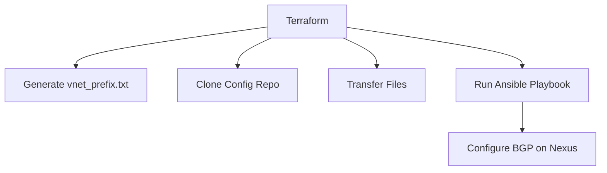

# Cisco BGP Automation with Terraform and Ansible

This directory contains Terraform configurations for automating BGP peering setup on Cisco Nexus devices.

---

### ⚠️ WARNING: USE RESPONSIBLY

> These scripts and tools are powerful.  
> **Do not run in production without testing.**  
> Always validate in a lab or limited environment first.  
> Make sure you **understand what each script does** before executing.  
> **Use at your own risk.**

---

## 🧠 Architecture Overview



**How it works:** Terraform initializes the setup, generates required files, transfers them to the Ansible control node, and triggers an Ansible playbook that configures BGP on the target Nexus switch.

---

## ✅ Prerequisites

- **Terraform** v1.0 or higher
- **Ansible** v2.9 or higher (on a control node)
- **Python** (required for Ansible modules)
- Ansible control node must have:
  - SSH access to Nexus devices
  - Git installed
- Base64-encoded credentials for SSH (used by Terraform)
- SSH keys recommended (optional)

---

## ⚙️ Configuration Workflow

1. **Input Variables** - Set in `terraform.tfvars`:
   ```hcl
   test_vnet_prefix       = "10.0.0.0/16"
   ansible_vm_ip          = "192.168.1.100" 
   ansible_vm_user        = "admin"
   ansible_vm_password_base64 = "base64encodedpassword"
   ```

2. **Run Terraform**
   ```bash
   terraform init
   terraform plan
   terraform apply
   ```

3. **Execution Steps** (defined in `main.tf`):
   - Generates network prefix file
   - Clones configuration repository
   - Transfers required files
   - Runs Ansible playbook to configure BGP

---

## 📁 File Descriptions

| File | Purpose |
|------|---------|
| `main.tf` | Main Terraform configuration |
| `variables.tf` | Input variable definitions |
| `terraform.tfvars` | Variable values (create from example) |
| `hosts.ini` | Ansible inventory file |
| `nexus_bgp.yml` | Ansible playbook for BGP config |
| `vnet_prefix.txt` | Generated file containing network prefix (auto-created) |

---

## 🔐 Security Notes

- Passwords are **base64-encoded**, but not encrypted—consider using:
  - **SSH key-based authentication**
  - **HashiCorp Vault** or **Ansible Vault** for secure secret storage
  - **Ephemeral credentials** for automation
- Ensure `.ssh/known_hosts` is prepopulated or SSH key checking is handled
- Do **not commit** `terraform.tfvars` or secrets to Git

---

## 🧪 Validation

The following input checks are enforced:

- Valid CIDR notation (`test_vnet_prefix`)
- Proper base64 encoding (`ansible_vm_password_base64`)
- Valid IP/FQDN for Ansible control node (`ansible_vm_ip`)

> ✅ Upon success, verify Nexus BGP config with:

```bash
show ip bgp summary
```

---

## 🧰 Troubleshooting

Check Terraform logs and verify:
1. Ansible control node connectivity
2. Repository clone success
3. File transfers completed
4. SSH host keys properly added

---

## 📘 References

- [Terraform Docs](https://www.terraform.io/docs)
- [Ansible for Network Automation](https://docs.ansible.com/ansible/latest/network/index.html)
- [Cisco Nexus BGP Configuration Guide](https://www.cisco.com/c/en/us/support/switches/nexus-9000-series-switches/products-installation-and-configuration-guides-list.html)
