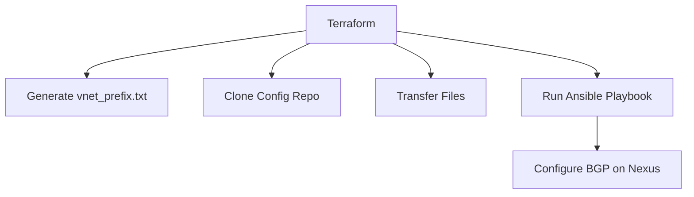

# Cisco BGP Automation with Terraform and Ansible

This directory contains Terraform configurations for automating BGP peering setup on Cisco Nexus devices.

## Architecture Overview



## Prerequisites

- Terraform 1.0+
- Ansible control node with:
  - SSH access to network devices
  - Git client
  - Ansible 2.9+
- Base64 encoded credentials for Ansible control node

## Configuration Workflow

1. **Input Variables** - Set in `terraform.tfvars`:
   ```hcl
   test_vnet_prefix       = "10.0.0.0/16"
   ansible_vm_ip          = "192.168.1.100" 
   ansible_vm_user        = "admin"
   ansible_vm_password_base64 = "base64encodedpassword"
   ```

2. **Execution Steps** (defined in `main.tf`):
   - Generates network prefix file
   - Clones configuration repository
   - Transfers required files
   - Runs Ansible playbook to configure BGP

## File Descriptions

| File | Purpose |
|------|---------|
| `main.tf` | Main Terraform configuration |
| `variables.tf` | Input variable definitions |
| `terraform.tfvars` | Variable values (create from example) |
| `hosts.ini` | Ansible inventory file |
| `nexus_bgp.yml` | Ansible playbook for BGP config |
| `vnet_prefix.txt` | Generated file containing network prefix (auto-created) |

## Usage

```bash
# Initialize Terraform
terraform init

# Plan changes
terraform plan

# Apply configuration
terraform apply
```

## Security Notes

- Passwords are base64 encoded but consider using:
  - SSH keys instead of passwords
  - HashiCorp Vault for credential management
  - Temporary credentials for automation

## Validation

The configuration includes input validation for:
- CIDR notation in network prefixes
- Valid IP addresses/FQDNs
- Proper base64 encoding

## Troubleshooting

Check Terraform logs and verify:
1. Ansible control node connectivity
2. Repository clone success
3. File transfers completed
4. SSH host keys properly added
